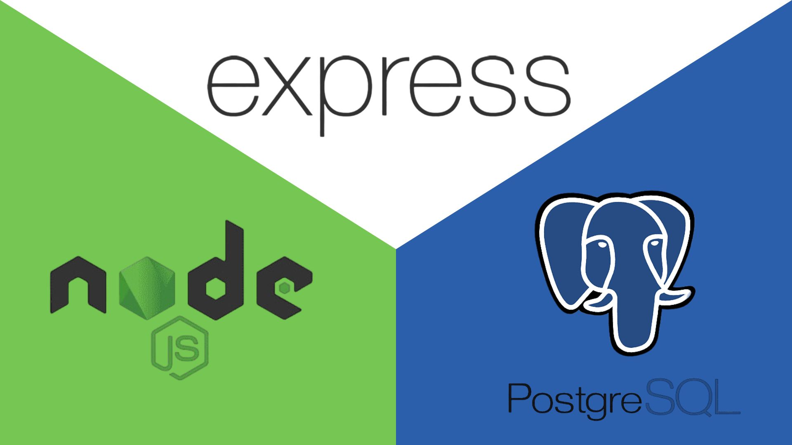

<p align="center">

</p>


# Proyecto - 05 Bank - App 


## Descripcion del Proyecto

Este proyecto es una api de banco, que permitira crear un usuario y al crearlo automaticamente tendra su numero de cuenta y un monto de dinero de 1000, inciar seccion y podra tambien hacer transacciones con el usuario ingresado a otras cuentas de usuarios y ver su historial de transacciones.
La aplicacion esta construida utilizandoo node.js express.js y utuliza como base de datos PostgresSQL para almacenar la informacion

## Caracteres principales

1. Crear un usuario

2. iniciar seccion

3. transferir dinero de una cuenta a otra

4. Ver Historial de transacciones


# Tecnologias Utilizadas

1. express: un framework minimalista de node.js que facilita la creacion de aplicaciones web y APIs.

2. postgreSQL: es un sistema de gestión de bases de datos relacional orientado a objetos y de código abierto.


3. sequelize: Un ORM (Object Relational Mapper) para bases de datos SQL. que simplifica el trabajo con bases de datos SQL escribiendo código JavaScript en lugar de SQL.

4. Morgan: es una herramienta muy útil para registrar y monitorear solicitudes HTTP en aplicaciones de esta magnitud como Node.js y Express. Proporciona información valiosa para el desarrollo y la depuración, lo que permite comprender mejor el flujo de tus solicitudes y respuestas

5. jsonwebtoken: es una implementación de JSON Web Tokens (JWT) para Node.js que permite la creación y verificación de tokens JWT.

6. express-validator: es un middleware de validación de datos para Express. Proporciona validación y saneamiento de datos de entrada

7. express-rate-limit: es un middleware que se utiliza para limitar las solicitudes repetidas a APIs públicas y / o puntos finales como la autenticación y el restablecimiento de contraseñas.

8. helmet: es un middleware de seguridad que ayuda a proteger las aplicaciones Express / Connect de algunas de las vulnerabilidades conocidas de la web mediante la configuración de encabezados HTTP adecuados.


## Requisitos previos para la utilizacion del proyecto

1. tener instalado node.js

2. tener instalado postgresSQL

3. tener creada una base de datos en postgresSQL


## Como ejecutar el proyecto en desarrollo

1. clonar el repositorio

2. ejecutar el siguiente comando para instalar las dependencias:
```

  npm install

```
3. crear una base de datos local en postgreSQL

4. clonar el .env.template y renombrarlo a .env y llenar las variables de entorno

5. levantar el modo desarrollo con el siguiente comando:
```

  npm run start:dev

```